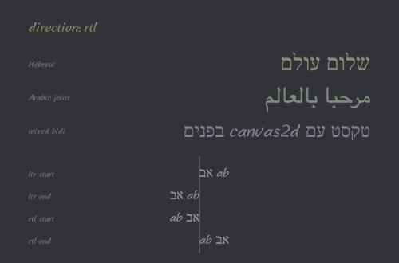
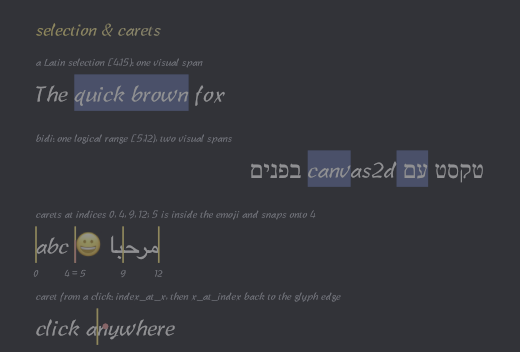
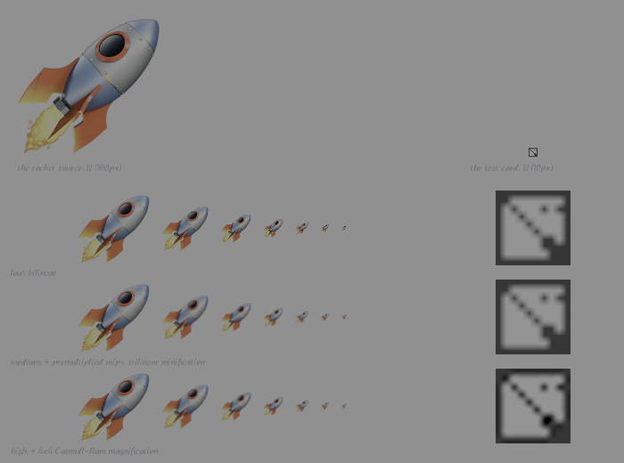
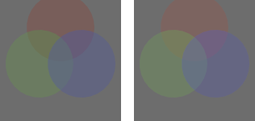
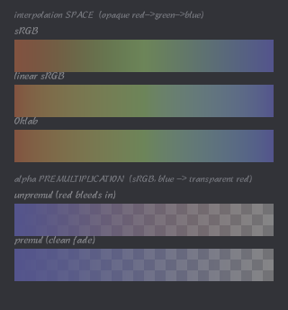
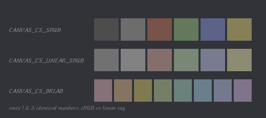

# canvas2d

[](https://github.com/mtklein/canvas2d/actions/workflows/gate.yml)

A C23 implementation of a subset of the HTML Canvas 2D API. Geometry,
antialiasing, compositing, gradients, text rasterization, blur, and a PNG codec
run on the CPU; Core Text supplies glyph outlines. Built with ninja, compiled
under `-fbounds-safety`.

Build and safety notes: [docs/bounds-safety.md](docs/bounds-safety.md).
Performance studies: [docs/pixel-pipelines.md](docs/pixel-pipelines.md),
[docs/stencil-blur.md](docs/stencil-blur.md),
[docs/rasterization.md](docs/rasterization.md).

## Gallery

Each image is written by the in-tree PNG encoder
([examples/gallery.c](examples/gallery.c)); regenerate with `ninja images`.

Transforms, `save`/`restore`, global alpha, filled Béziers and arcs, strokes:


`transform` — affine matrices beyond translate/rotate/scale: skew, anisotropic
scale, reflection, shear. A dashed identity footprint sits behind each deformed
"F":


Winding rules — a donut (nonzero hole), and a self-intersecting pentagram
filled nonzero (solid centre) vs even-odd (hollow centre):


Line dashing — `setLineDash` patterns and a dashed arc:


Line joins (miter / round / bevel) and caps (butt / round / square):


`miterLimit` and `lineDashOffset` — one V at four miter limits (below the
spike's ratio the join bevels, above it the miter survives), and one dash
pattern at five offsets:


Path primitives — a filled ellipse and a rounded rectangle (filled and
outlined):


`roundRect` with per-corner elliptical radii — uniform, flattened (rx≠ry),
opposite corners sharp, all-different, and a capsule whose oversized radii are
scaled down by the CSS overlap rule:


`strokeRect` — the three joins on a thick outline, a dashed rect, a rotated-CTM
quad with a gradient stroke, and a zero-extent rect (strokes a round-capped
line):


`Path2D` — a reusable path object drawn under twelve rotations, and `add_path`
composing a ring with its hole for an even-odd fill with a stroked star in the
hole:


Clipping — a circular window, the intersection of two discs, and a
self-intersecting star, each masking the same flood of stripes:


Gradients — a diagonal linear fill outlined with a gradient stroke, an
off-centre radial, and a multi-stop rainbow ramp:


`createConicGradient` — a rainbow wheel, a hard-stop pie (coincident stop
offsets give crisp sector edges), and a conic-gradient stroke ring around a
two-tone conic medallion:


`createPattern` — a tile under each repeat mode (`repeat` / `repeat-x` /
`repeat-y` / `no-repeat`), then the pattern used as a fill paint for a headline:


Batching — 320 translucent discs, each its own `fill()`, composited in order:


`drawImage` — a 16×16 source drawn 1:1, scaled up (bilinear), and scaled and
rotated:


`imageSmoothingEnabled` — a 16×16 pixel-art source upscaled with smoothing off
(nearest-neighbour) vs on (bilinear):


`drawImage` source-rect overload — a sprite atlas built on a scratch canvas and
read back to RGBA8, with four tiles drawn enlarged by source rectangle:


`getImageData` captures the leftmost motif; `putImageData` stamps the copies:


`createImageData` builds one rainbow-ring image; `putImageData` stamps it whole
(left), and the dirty-rectangle overload writes a checkerboard of sub-rects
(right):


Text — `fillText`/`strokeText` in Libian TC (隸書), glyph outlines from Core
Text rasterized by the coverage fill, taking a gradient fill, a stroke, and the
transform; one `fill_text` mixes Latin and Chinese (UTF-8):


`textAlign` / `textBaseline` — three words at one vertical anchor (each names
its alignment), and "Hg" set six ways against one horizontal baseline guide:


`measureText` — a word at its alphabetic origin with the `TextMetrics`
overlaid: the ink box, the font box, the advance width, the
hanging/alphabetic/ideographic baselines, and the origin:


`fillText` `maxWidth` — the same phrase unconstrained (overflowing the right
marker) and condensed in x to a `maxWidth` equal to the marked span:


`globalCompositeOperation`, the Porter-Duff operators — a blue destination
square and an orange source disc over a transparency checkerboard. Operators
are bounded by the source's coverage: partial coverage lerps between the blend
and the destination, so pixels the disc does not touch keep the destination,
including under `copy` and the `-in`/`-out` family (docs/rasterization.md §3.8):


`globalCompositeOperation`, the blend modes — all fifteen (eleven separable,
four non-separable), each compositing two discs over a gradient via the W3C
composite+blend formula. With the eleven Porter-Duff operators, 26 modes total:


Hit testing — sample points stippled `isPointInPath` (a pentagram under
even-odd, so the central pentagon reads as outside) and `isPointInStroke`
(points within a thick ring's stroke band):


Shadows — a sharp drop shadow, a soft blurred shadow, and a text shadow; the
op's alpha blurred by the separable box blur (≈ Gaussian), tinted, offset, and
composited under the shape. The bottom row steps one sharp shadow across
quarter-pixel offsets: subpixel placement lands on a 1/256th-px grid (a 2-tap
lerp), so the edge ramps rather than snapping a whole column at a time:


Color emoji — Core Text falls back to AppleColorEmoji; each color glyph is
rasterized once into a 160px RGBA8 capture, and every draw samples a mip
pyramid derived from it through the same bilinear path as `drawImage`:


Text shaping and fallback — one `fill_text` per line, each a greeting in a
different script. Core Text picks the fallback font per run (eight faces here),
shapes Devanagari conjuncts, and renders color emoji, all through the coverage
rasterizer:


RTL — the `direction` attribute drives bidi layout: Hebrew and Arabic
paragraphs hang from the right margin (`start` anchors right under `rtl`),
Arabic joins contextually, a mixed line reorders embedded Latin, and one bidi
string hangs off a single anchor under each direction × `start`/`end` pairing:



Selection and carets — the shaped line answers hit-testing queries. A Latin
selection fills one highlight span under the glyphs; one logical range over a
mixed-direction line returns two visual spans (the embedded Latin reorders);
carets sit at cluster edges, with an index inside the emoji's surrogate pair
snapping onto the cluster's leading edge; and a click round-trips through
`index_at_x` → `x_at_index` to the caret on its glyph's left edge:



Minification on a ruler — one emoji at geometrically increasing sizes,
overlapping at 80% alpha, past the 160px capture into upscale, then the same
ramp progressively rotated (level selection answers the transformed device
footprint, not the nominal font size):


`imageSmoothingQuality` — one row per quality tier. The rocket is a
`canvas_snapshot` of a scratch canvas with its mips built by
`canvas_image_build_mips`; the test card is a `canvas_image` without mips. The
minify ramp downscales the rocket axis-aligned: `low` (the default) is bilinear
and shimmers as the taps undersample; `medium` samples a premultiplied mip
chain with trilinear filtering. The magnify cell (right) is a hard-edged test
card: at 8× bilinear and `high`'s 4×4 Catmull-Rom differ on single-pixel dots,
checker, and a diagonal:



`filter` — a gradient tile under two translucent discs through each of the eight
colour functions, plus `blur()` and `drop-shadow()` rows. Each function is a
typed call (`canvas_add_filter_*`), applied to the op's premultiplied tile
before its shadow and composite: the colour functions are a 3×3 matrix +
alpha-scaled offset, `blur()` is three box passes (≈ Gaussian) with the painted
region grown for the skirt, and `drop-shadow()` composites the drawing over a
blurred, offset, tinted copy of its alpha. Chained cells show list order:
`blur(3)` then `saturate(3)`, and `grayscale(1)` then a violet `drop-shadow()`:


Working colour space — the same translucent discs composited on an sRGB canvas
(left, gamma-space blending) and an extended-linear-sRGB canvas (right,
linear-light blending). Same colours and coverage; only the compositing space
differs. The disc overlaps differ: linear-light crossings stay brighter and
more saturated than the gamma-space ones:



`createLinearGradient` interpolation — two independent controls. Top, the
interpolation space: the same opaque red→green→blue ramp in sRGB (dark
midpoints), linear sRGB (brighter), and Oklab (perceptually even); at full
alpha this isolates the space. Bottom, alpha premultiplication, the space fixed
at sRGB: a blue→transparent-red fade over a checkerboard, unpremultiplied (the
transparent end bleeds a tint into the ramp) vs premultiplied (the colour fades
in alpha only):



Explicit colour spaces — each colour the API takes names its space. Row 1 tags
six numeric RGBA triples sRGB; row 2 tags the same numbers
extended-linear-sRGB, which encode to sRGB on the way to the surface and land
brighter (linear 0.5 → sRGB ≈ 0.74); row 3 tags eight swatches Oklab at one
lightness with the hue swept around the a/b circle:



## Quick start

```sh
python3 configure.py     # generate build.ninja (first run; it self-regenerates after)
ninja                    # build every variant, run the suite, re-render the gallery
ninja test               # just the tests (subset of the default build)
ninja images             # just (re)render the gallery PNGs (subset of default)
ninja fuzzers            # build the libFuzzer harnesses (needs brew llvm; fuzz/README.md)
ninja benchcmp           # hyperfine: release vs unsafe (cost of -fbounds-safety)
ninja profile            # sample(1): per-kernel self-time within each bench
ninja profile-scene      # sample(1): self-time across the whole gallery (real scenes)
ninja throughput         # size-normalised render throughput (Mpx/s, ns/px)
ninja coverage           # refresh docs/coverage.md (llvm-cov over src/, all tests)
```

The coverage report is checked in at [docs/coverage.md](docs/coverage.md);
`ninja coverage` regenerates it, so a `git diff` shows what moved.

When a change re-baselines gallery pixels, `python3 tools/gallery_diff.py [ref]`
produces the image equivalent of `git diff <ref> -- gallery/`: every changed
scene as before/after in one HTML page — side-by-side, swipe, blink, and a
diff heatmap with changed-pixel stats (defaults to `github/main`).

Requirements: macOS with Xcode (Apple clang 21+, which has `-fbounds-safety`
and `#embed`), and ninja. `ninja benchcmp` also needs
[hyperfine](https://github.com/sharkdp/hyperfine). Core Text supplies glyph
outlines; everything else is in-tree.

Variants are produced from one source tree, differing only in the
optimisation/safety flags:

| Variant | Flags | Notes |
|---|---|---|
| `release` | `-Os -fbounds-safety` | the shipping build; bounds checks trap |
| `debug` | `-O0 -g -fbounds-safety -fsanitize=address,integer,undefined -fno-sanitize-recover=all` | any sanitizer finding is fatal |
| `unsafe` | `-Os` | release minus `-fbounds-safety`; the benchmark baseline |
| `tsan` | `-O1 -fbounds-safety -fsanitize=thread` | data races; core + the thread harness only (TSan cannot combine with the debug sanitizers) |

The default build runs every test binary in both checked variants (`release`
and `debug`); `ninja test` is the same set on its own. It also re-renders the
gallery into the committed `gallery/*.png`: those PNGs are build outputs gated
on the gallery binary, so a rendering change relinks it, re-renders them, and
shows up as a `git diff` — review and commit the new PNGs alongside the code.
Tests are silent on success; a failing test prints the offending `CHECK` to
stderr.

Thread safety. The library creates no threads and never synchronizes — no
locks, no atomics, no shared mutable state in `src/` (every `static` is a
`const` table). Distinct canvases are independent and may be used from distinct
threads concurrently; N canvases over small tiles is the supported way to
parallelize. A single canvas is not internally synchronized: using one canvas
(or sharing a `canvas_path2d` still being mutated) from two threads requires
the caller's own serialization. `tests/test_threads.c` covers it: pthread
workers each rendering their own 256×256 tile canvas of a shared scene,
stitched and byte-compared against the same tiling rendered serially, run by a
bare `ninja` in the checked variants and again under the `tsan` variant.

## Architecture

```
        public API (include/canvas.h)
                  │
   canvas.c  ── state stack, CTM, styles; rasterizes coverage, shades tiles, and
      │          blends them onto its own premultiplied RGBA16F target (all 26
      │          composite/blend modes, one planar kernel)
      ├── cnvs_math     2x3 affine transforms
      ├── cnvs_path     subpath storage + adaptive Bézier/arc flattening
      ├── cnvs_cover     analytic (signed-area) coverage → per-pixel alpha
      ├── cnvs_gradient linear/radial/conic gradients, evaluated per pixel into a tile
      ├── cnvs_stroke   polyline → stroke triangles (joins, caps, dashes)
      ├── cnvs_image    clipped 2D RGBA8 blits (get/putImageData)
      ├── blur          separable box blur (shadows + filter blur()/drop-shadow(), ≈ Gaussian)
      ├── cnvs_geom     growable vertex/int buffers
      ├── cnvs_zlib     deflate + strict inflate (RFC 1950/1951) + adler32
      ├── cnvs_png      → PNG: 16-bit Rec.2020/PQ (BT.2100) Up-filtered encoder, output only
      ├── cnvs_color    sRGB transfer + linear-sRGB ↔ Oklab conversions
      ├── cnvs_record   draw calls → text canvas-program (the write side)
      ├── cnvs_replay   text canvas-program → draw calls (the read side)
      │
      ▼   cnvs_text.h   (C ABI: shaped runs, glyph outlines/bitmaps, font metrics)
      cnvs_text_ct.c  ── Core Text shaping + glyphs; built without -fbounds-safety
```

Everything above the `cnvs_text.h` ABI line compiles under `-fbounds-safety`.
One boundary crosses to a system framework, behind a bounds-safe C ABI:

- The [Core Text shim](src/cnvs_text_ct.c) shapes UTF-8 into glyph runs (with
  font fallback) and hands each glyph across once in canonical form: font-unit
  outline curves — which the same coverage rasterizer fills/strokes at every
  size and transform — or, for a color glyph (emoji), one fixed-size RGBA8
  capture that every draw samples through a mip pyramid.

Compositing runs in canvas.c, not a separate module: geometry, antialiasing,
gradient evaluation, and clipping produce premultiplied `_Float16` RGBA16F
tiles, and canvas.c's planar blend kernels composite them onto the
premultiplied target (all 26 modes, ~350 lines, over `__counted_by` tiles).
`_Float16` is both the storage and the compute type, and planar (SoA) is the
compute layout: the blend, filter, premultiply, and readback kernels process
eight pixels at a time as four 8-lane channel planes, deinterleaved at the
buffer seams by ld4/st4 ([src/cnvs_planar.h](src/cnvs_planar.h)). The storage
type and layout, and their measurements, are in
[docs/decisions/color-axis.md](docs/decisions/color-axis.md) and
[docs/decisions/float16-color-type.md](docs/decisions/float16-color-type.md). A
Metal GPU backend implemented the same compositing ABI and was held bit-for-bit
identical to this kernel by a tolerance-0 differential; it was removed after the
CPU path won the flagship workload — see
[docs/decisions/metal-backend.md](docs/decisions/metal-backend.md) and
[docs/decisions/backend-differential.md](docs/decisions/backend-differential.md).

> [cnvs_text_ct.c](src/cnvs_text_ct.c) is the only translation unit not under
> `-fbounds-safety`. The Core Text headers carry no bounds attributes, so
> binding them from checked code would require forging every opaque handle and a
> scoped cast for `CGPathApply`'s callback; isolating that in one unchecked TU
> (still ASan/UBSan-instrumented in debug) keeps the rest of the core checked.
> `__counted_by`/`__single` pointers share the plain-C-pointer ABI, so the
> interface header is identical on both sides. See
> [docs/bounds-safety.md](docs/bounds-safety.md).

## Public API (subset of Canvas 2D, snake_case)

```c
struct canvas *cv = canvas(width, height);   // (write struct canvas *__single cv under -fbounds-safety)
canvas_resize(cv, width, height)                             // realloc + clear + reset
canvas_is_context_lost                                        // always false (headless)
canvas_save / canvas_restore / canvas_reset
canvas_translate / scale / rotate / transform / set_transform / reset_transform / get_transform
canvas_set_fill_rgba / set_stroke_rgba / set_global_alpha    // colours take an explicit colour space
canvas_set_global_composite_operation                        // 26 GCO modes
canvas_set_shadow_color_rgba / set_shadow_blur / set_shadow_offset_x / set_shadow_offset_y
canvas_set_filter_none / add_filter_blur / add_filter_brightness / add_filter_contrast /
    add_filter_drop_shadow / add_filter_grayscale / add_filter_hue_rotate /
    add_filter_invert / add_filter_opacity / add_filter_saturate / add_filter_sepia
canvas_set_fill_linear_gradient / set_fill_radial_gradient / set_fill_conic_gradient / add_fill_color_stop / set_fill_pattern
canvas_set_stroke_linear_gradient / set_stroke_radial_gradient / set_stroke_conic_gradient / add_stroke_color_stop / set_stroke_pattern
canvas_set_line_width / set_line_join / set_line_cap / set_miter_limit
canvas_set_line_dash / get_line_dash / set_line_dash_offset
canvas_clear_rect / fill_rect / stroke_rect
canvas_begin_path / move_to / line_to / rect / quadratic_curve_to /
    bezier_curve_to / arc / ellipse / round_rect / round_rect_radii / arc_to / close_path
canvas_fill(rule) / canvas_stroke / canvas_clip(rule) / is_point_in_path / is_point_in_stroke
canvas_path2d() / ..._move_to / line_to / curves / arc / rect / round_rect / close / add_path / canvas_path2d_free
canvas_fill_path / stroke_path / clip_path / is_point_in_path2d / is_point_in_stroke_path  // Path2D
canvas_get_image_data / put_image_data / create_image_data / read_rgba / write_png / read_png
canvas_draw_bitmap / draw_bitmap_scaled / draw_bitmap_subrect   // borrowed RGBA8
canvas_image_unorm8 / canvas_image_f16 / canvas_snapshot / canvas_image_build_mips / canvas_image_width / canvas_image_height / canvas_image_free
canvas_draw_image / draw_image_scaled / draw_image_subrect   // reified image
canvas_set_image_smoothing_enabled / set_image_smoothing_quality
canvas_set_font_size / set_text_align / set_text_baseline / set_direction
canvas_measure_text / measure_text_full / fill_text / fill_text_max / stroke_text / stroke_text_max  // Libian TC, UTF-8
canvas_free(cv);
```

Coordinates are pixels, origin top-left, +y down.

## Capabilities and limitations

A subset of the Canvas 2D API; several rows are partial relative to the full
spec. [docs/roadmap.md](docs/roadmap.md) is the gap inventory (missing,
partial, planned).

| Area | Status |
|---|---|
| Transforms, save/restore, alpha blending | ✅ |
| `fill_rect` / `clear_rect` / `stroke_rect`, solid fills, PNG export + load (Up-filtered rows, in-house deflate; the loader is strict and scoped to our own files) | ✅ |
| Paths: lines, rects, Béziers, arc, ellipse, roundRect, arcTo | ✅ (roundRect: per-corner elliptical radii) |
| `fill()` — winding rules (nonzero + even-odd), holes, self-intersection | ✅ analytic coverage |
| `stroke()` — width (CTM-scaled), miter/round/bevel joins, butt/round/square caps, line dash | ✅ |
| `getImageData` / `putImageData` (clipped 2D blits, dirty-rect, createImageData) | ◑ no colorSpace |
| `clip()` — arbitrary paths, intersection, save/restore nesting | ✅ coverage mask |
| Gradients — linear + radial + conic, fills and strokes, multi-stop; interpolation space (sRGB/linear/Oklab) × alpha (premul/unpremul) | ✅ per-pixel exact stop lerp, 8-wide (≤0.16/255 of exact, hard stops exact) |
| Anti-aliasing | ✅ analytic coverage, both axes (fills, strokes, clips) |
| `drawImage` — transform/clip/alpha-aware, `imageSmoothingEnabled` (bilinear/nearest), `imageSmoothingQuality` (medium/high: premultiplied mips + trilinear minification; high: 4×4 Catmull-Rom magnification); sources are borrowed bitmaps or reified `canvas_image`s in any of {unorm8, f16} × {unpremul, premul}; `canvas_snapshot` is canvas-as-source (premultiplied f16, one memcpy); `canvas_image_build_mips` caches the pyramid explicitly | ◑ DOM sources out of scope |
| Colour — every colour input/output names a colour space {sRGB, extended-linear-sRGB, Oklab}; compositing in sRGB or extended-linear-sRGB | ◑ sRGB primaries only |
| Text — `fillText`/`strokeText`, Libian TC, Latin + Chinese (UTF-8), color emoji (Core Text fallback; one canonical 160px capture per glyph, mip-sampled at draw), gradient/stroke/transform, `textAlign`/`textBaseline`, `direction` (rtl: bidi run order, neutral resolution, start/end) | ◑ no font-family/weight; full `measureText` TextMetrics |
| Record/replay — `record_to`/`replay_from`: a session writes a self-contained text canvas-program covering every pixel-affecting op (font/glyph/bitmap/shape blocks for text, numbered image blocks naming their {unorm8, f16} × {unpremul, premul} format for bitmap/image/putImageData/pattern sources with `image_mips` carrying mip state, numbered path blocks for Path2D, plus op lines with optional per-colour space tokens); replay reproduces the render with no Core Text call — gallery scenes replay byte-for-byte on a machine without the fonts (gated by `test_replay_gallery`) | ✅ see [docs/text-boundary.md](docs/text-boundary.md) |
| Compositing — all 26 `globalCompositeOperation` modes (Porter-Duff + blend modes) | ✅ |
| Hit testing — `isPointInPath` / `isPointInStroke` (+ `Path2D` overloads) | ✅ winding + even-odd, transform-aware |
| `createPattern` — image patterns, repeat/repeat-x/-y/no-repeat, transform-pinned | ✅ borrowed RGBA8, bilinear/nearest |
| `Path2D` — build, `addPath`, fill/stroke/clip/isPointIn* overloads | ✅ no SVG path-data string |
| Shadows — `shadowColor`/`shadowBlur`/`shadowOffset{X,Y}`, under fills/strokes/text/images | ✅ box-blur (≈ Gaussian), cast from the op's source alpha post-filter, subpixel offsets |
| `filter` — eight colour functions (brightness/contrast/grayscale/hue-rotate/invert/opacity/saturate/sepia) + `blur()` + `drop-shadow()` (3-pass box ≈ Gaussian), per painted op, in list order | ✅ typed API, no CSS string form |
| Many independent fills in one frame | ✅ composited in order onto a shared target |

## Benchmarking

`release` vs `unsafe` (same `-Os`, with and without `-fbounds-safety`) isolates
the cost of the bounds checks:

```sh
ninja benchcmp     # hyperfine: each phase + end-to-end, release vs unsafe
ninja profile      # sample(1): per-kernel self-time within a phase
```

Hot paths are benchmarked in isolation ([bench/](bench/)), plus an end-to-end
run; all CPU-only. A run on an Apple Silicon laptop:

| Phase | `release` (checked) | `unsafe` | overhead |
|---|---|---|---|
| `bench_gradient` — gradient eval, per-pixel stop scan (radial solve + colour lerp) | 71 ms | 71 ms | **1.00×** |
| `bench_stroke` — stroke expansion: 4-wide segment/join planes, block-staged verts | 26 ms | 26 ms | **1.00×** |
| `bench_gradient_fill` — gradient fill: 8-wide radial solve + 8-wide exact stop lerp | 14.5 ms | 14.4 ms | **1.01×** |
| `bench_flatten_real` — cubic flattening, median case (arc / glyph-like curves) | 39 ms | 39 ms | **1.00×** |
| `bench_flatten` — cubic flattening, worst case (random control points) | 118 ms | 116 ms | **1.01×** |
| `bench_blit` — clipped 2D RGBA8 blit (getImageData copy) | 9.0 ms | 8.8 ms | **1.02×** |
| `bench_blur_v` — box blur, vertical pass (8 columns per step) | 15 ms | 14 ms | **1.10×** |
| `bench_blur_h` — box blur, horizontal pass (8-wide windows) | 34 ms | 30 ms | **1.11×** |
| `bench` — end-to-end (renders + PNG-encodes each frame; codec-bound) | 42 ms | 38 ms | **1.11×** |
| `bench_fill` — analytic coverage fill (8-wide accumulate + resolve) | 30 ms | 26 ms | **1.14×** |
| `bench_render_large` — a full gallery-scale scene, planar f16 compositing | 179 ms | 147 ms | **1.22×** |
| `bench_render` — the same at default size | 18 ms | 15 ms | **1.23×** |
| `bench_png` — PNG encode, synthetic run-heavy 256×256 (long-match stress) | 14 ms | 9.6 ms | **1.40×** |

Per-element bounds checks are the cost, so a kernel's overhead tracks how much
it indexes versus computes; 8-wide kernels amortize the checks toward 1.0×.
Optimizing compute shrinks the total time, not the checks' absolute share, so a
faster kernel can show a higher ratio over a smaller base (the flagship render
rows: 1.14× before the f16/planar work, 1.22–1.23× after).

The table fixes the flag at `-Os` on both sides. Giving the unsafe side its own
best flag is measured in
[docs/decisions/opt-level.md](docs/decisions/opt-level.md): against unsafe at
`-O2` the geomean reads 1.14×, the flagship render ~1.18×, the deflate matcher
1.63×, with the checked `-Os` binary 30% smaller. Per-kernel optimization
detail: [docs/stencil-blur.md](docs/stencil-blur.md) (blur),
[docs/decisions/gradient-eval.md](docs/decisions/gradient-eval.md) (gradient),
[docs/decisions/color-axis.md](docs/decisions/color-axis.md) (compositing).

## Roadmap

[docs/roadmap.md](docs/roadmap.md) is the gap inventory.
`globalCompositeOperation`, the blend kernels, shadows, and `filter` are done.

- `filter` — the eight colour functions as per-pixel matrix kernels over
  premultiplied tiles ([cnvs_filter.c](src/cnvs_filter.c)), `blur()` as an
  RGBA16F box blur ([blur.c](src/blur.c)) against transparency, and
  `drop-shadow()` (the tile over a blurred, offset, tinted copy of its alpha).
  Not offered: the CSS string form and `url()` SVG reference filters.

Not planned:

- `-fbounds-safety` on the Core Text shim. Its headers carry no bounds
  attributes, so checked binding would require forging every opaque handle and
  a scoped cast for `CGPathApply`, with no added safety (the output buffers are
  checked-owned regardless). It stays an isolated boundary shim behind a
  bounds-safe C ABI. See [docs/bounds-safety.md](docs/bounds-safety.md).

## Layout

```
configure.py             generates build.ninja (all variants + gates; self-regenerates)
include/canvas.h         public API
src/                     core; Core Text shim
tests/                   unit + pixel tests, a bounds-safety trap test, the OOM fault-injection sweep, the threaded tile-stitch harness
bench/                   isolated kernel benches + end-to-end (ninja benchcmp / profile / throughput)
fuzz/                    libFuzzer harnesses + committed regression corpus (ninja fuzzers)
examples/gallery.c       renders the gallery PNGs (ninja images)
gallery/                 committed PNGs
docs/bounds-safety.md    build and safety notes
docs/decisions/          decision records
docs/roadmap.md          Canvas 2D gap inventory
docs/rasterization.md    rasterization survey: profile, option space, experiments
docs/coverage.md         checked-in coverage report (ninja coverage regenerates)
docs/*.md                pixel pipelines, stencil blur, gather LUT, range folding,
                         tag pointers, sparse coverage, the text boundary
```
