# canvas2d

[](https://github.com/mtklein/canvas2d/actions/workflows/gate.yml)

A C23 implementation of (a growing subset of) the HTML **Canvas 2D API**,
antialiased in C and composited on the GPU via **Metal**, built with **ninja**.

The point of the project is twofold:

1. **Learn `-fbounds-safety`** — Clang's spatial-memory-safety extension — by
   building something real with it.
2. **Show that C can play with the modern big boys (Rust).** The whole codebase
   compiles under `-std=c23 -fbounds-safety -Werror -Weverything` with only six
   warnings disabled (each documented), and the interesting work — path math,
   curve flattening, analytic-coverage antialiasing, stroking, gradients, a
   from-scratch zlib and PNG codec — lives in bounds-checked C. Metal is just a
   tile compositor.

If you want the reflective version — what worked, what fought back, what we'd do
differently — read **[docs/bounds-safety.md](docs/bounds-safety.md)**.
For a focused four-design study of where `-fbounds-safety` interferes with
performance (a vectorized pixel-processing VM, three ways), see
**[docs/pixel-pipelines.md](docs/pixel-pipelines.md)**; for the same lens on stencil
memory-access patterns (a separable blur, x vs y, and prefetch), see
**[docs/stencil-blur.md](docs/stencil-blur.md)**.

## Gallery

Every image below is rendered by the C core, composited on the GPU, and written by the in-tree
PNG encoder ([examples/gallery.c](examples/gallery.c)); regenerate with `ninja images`.

Transforms, `save`/`restore`, global alpha, filled Béziers and arcs, strokes:


`transform` — arbitrary affine matrices beyond translate/rotate/scale: horizontal
and vertical skew, anisotropic scale, reflection, combined shear. The dashed
identity footprint sits behind each deformed "F" (chosen because it has no
symmetry):

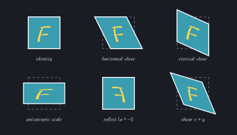

Winding rules — a donut (nonzero hole), then a self-intersecting pentagram filled
nonzero (solid centre) vs even-odd (hollow centre):


Line dashing — `setLineDash` patterns and a dashed arc:

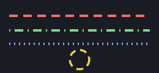

Line joins (miter / round / bevel) and caps (butt / round / square):

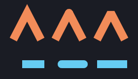

`miterLimit` and `lineDashOffset` — one sharp V at four miter limits (below the
spike's ratio the join bevels, above it the miter survives), and one dash pattern
at five offsets (the phase marching left, a frozen marching-ants animation):

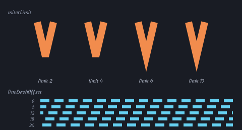

Path primitives — a filled ellipse and a rounded rectangle (filled + outlined):

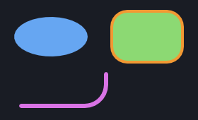

`roundRect` with per-corner elliptical radii — uniform, flattened (rx≠ry), a leaf
(opposite corners sharp), and an all-different grab-bag, plus a wide capsule whose
oversized radii are scaled down by the CSS overlap rule:

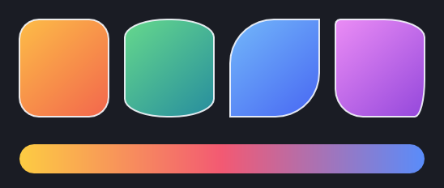

`strokeRect` — the three joins on a thick outline, a dashed rect, a rotated-CTM
quad with a gradient stroke, and the degenerate zero-extent rect (which strokes a
round-capped line):

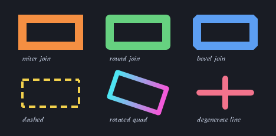

`Path2D` — a reusable path object transformed at draw time: one petal stamped
under twelve rotations into a flower (the same object, different CTMs), and
`add_path` composing a ring with its hole for an even-odd fill with a stroked star
in the hole:

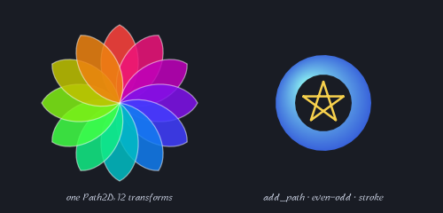

Clipping — a circular window, the intersection of two discs, and a
self-intersecting star, each masking the same flood of stripes (coverage mask):


Gradients — a diagonal linear fill (outlined with a cyan→yellow gradient
*stroke*), an off-centre radial "sphere", and a multi-stop rainbow ramp
(sampled per pixel on the CPU from a precomputed 1024-entry ramp, within 1/255 of
the exact piecewise-linear colour):

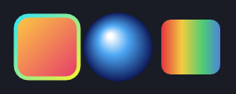

`createConicGradient` — a smooth rainbow wheel, a hard-stop "pie" (coincident stop
offsets give crisp sector edges), and a conic-gradient *stroke* ring around a
two-tone conic medallion:

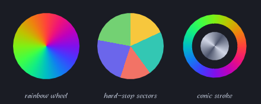

`createPattern` — a seamless tile under each repeat mode (`repeat` / `repeat-x` /
`repeat-y` / `no-repeat`; the un-tiled axes leave the ground showing), then the
same pattern used as a fill paint for a headline (glyph coverage samples it too):

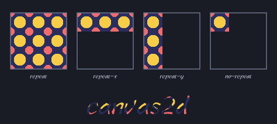

Batching — 320 translucent discs, each its own `fill()`, all submitted in a
single compositor command buffer (the alpha overlap shows ordering is preserved):

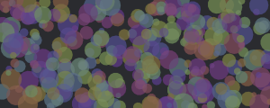

`drawImage` — a 16×16 source drawn 1:1 (crisp), scaled up (bilinear smoothing),
and scaled + rotated (AA quad edges from the coverage rasterizer):

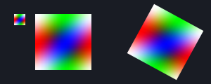

`imageSmoothingEnabled` — a 16×16 pixel-art source upscaled with smoothing off
(crisp nearest-neighbour blocks) vs on (bilinear blend):

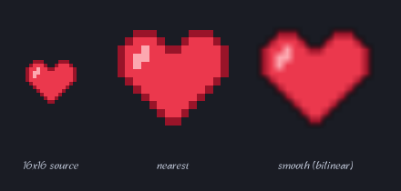

`drawImage` (source-rect overload) — a sprite atlas built on a scratch canvas and
read back to RGBA8, with four tiles pulled out by source rectangle and enlarged:

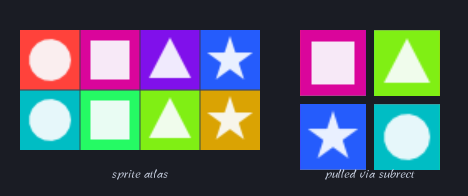

`getImageData` captures the leftmost motif; `putImageData` stamps the copies:

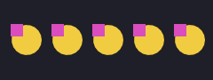

`createImageData` builds one rainbow-ring image; `putImageData` stamps it whole
(left), while the dirty-rectangle overload writes only a checkerboard of sub-rects
that register into the same picture (right):

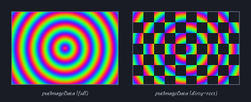

Text — `fillText`/`strokeText` in Libian TC (隸書, a clerical-script face), glyph
outlines from Core Text, rasterized by the same analytic-coverage fill as
everything else, so they take a gradient fill, a stroke, and the transform — and
one `fill_text` mixes Latin and Chinese (UTF-8):


`textAlign` / `textBaseline` — three words placed at one vertical anchor (each
names its own alignment), and "Hg" set six ways against one horizontal baseline
guide so each mode's vertical shift is visible:

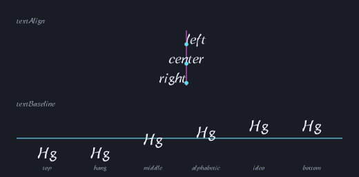

`measureText` — a word at its alphabetic origin with the full `TextMetrics`
overlaid: the tight actual (ink) box, the looser font box, the advance width, the
hanging/alphabetic/ideographic baselines, and the origin point:

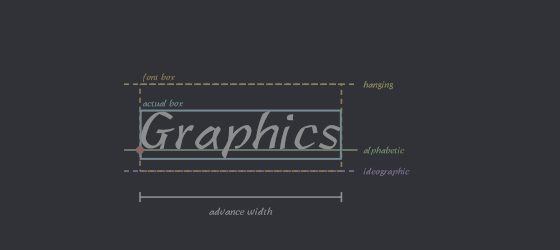

`fillText` `maxWidth` — the same phrase unconstrained (it overflows the right
marker) and with a `maxWidth` equal to the marked span (condensed horizontally in
x to fit):

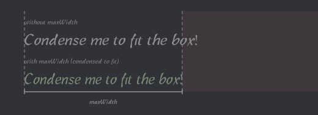

`globalCompositeOperation`, the Porter-Duff operators — how source alpha combines
with the destination (`source-in`, `xor`, `copy`, the `destination-*` family, …),
each compositing a blue "destination" square with an orange "source" disc over a
transparency checkerboard:

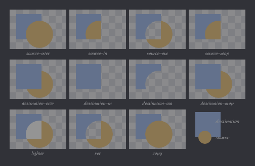

`globalCompositeOperation`, the blend modes — all fifteen (eleven separable plus
the four non-separable), each compositing the same two discs over a gradient via
the W3C composite+blend formula (a framebuffer-fetch shader on Metal, the
checked-C blend kernel on the CPU). With the eleven Porter-Duff operators above,
that's all 26 modes:

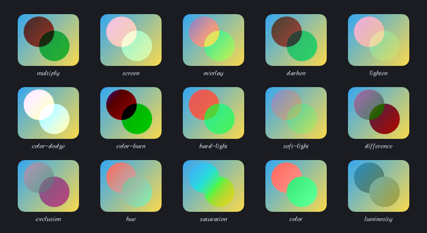

Hit testing — a grid of sample points stippled `isPointInPath` (a pentagram under
even-odd, so the central pentagon reads as outside) and `isPointInStroke` (only
points within a thick ring's stroke band hit):

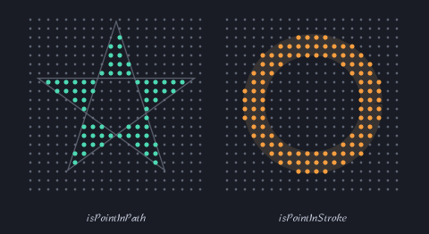

Shadows — a sharp drop shadow, a soft blurred shadow, and a text shadow; each is
the op's coverage blurred by the in-tree separable box blur (≈ Gaussian), tinted,
offset, and composited under the shape — all in checked C, so both backends match:

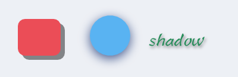

Color emoji — Core Text falls back to AppleColorEmoji; each color glyph is
rasterized **once** into a canonical 160px RGBA8 capture (the second text
boundary), and every draw samples a checked-C mip pyramid derived from it
through the same bilinear path as `drawImage` — so emoji mix inline with
Latin + Chinese and take the transform and shadow:

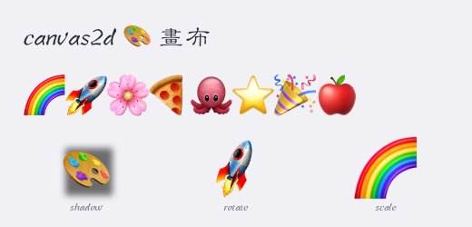

Text shaping + fallback — one `fill_text` per line, each a greeting in a different
script. Core Text picks the right fallback font per run (eight faces here), shapes
Devanagari conjuncts, and renders color emoji — all through the same coverage
rasterizer:

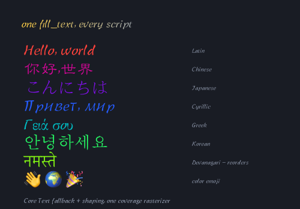

Mip quality on a ruler — the classic minification test is an animation zooming
over time; laying the sweep along x captures it in one still. One emoji at
geometrically increasing sizes (equal steps cross mip levels at equal rates, so
level-selection popping would read as periodic sharpness banding), overlapping
at 80% alpha, running past the 160px canonical capture into honest upscale
softness — then the same ramp progressively rotated, since level selection
answers the transformed device footprint, not the nominal font size:


`filter` — the same motif (a gradient tile under two translucent discs) through
each of the eight colour functions, unfiltered at top-left, plus `blur()` and
`drop-shadow()` rows. Every function is a typed API call (`canvas_add_filter_*`,
no string parsing) applied to the op's premultiplied tile in checked C, before
the shadow is cast and the tile composites: the colour functions compile at add
time to a 3×3 matrix + alpha-scaled offset (the translucent discs are what make
the premultiplied forms visible), `blur()` runs three box passes (≈ the spec's
Gaussian) with the painted region grown so the soft skirt outruns each shape,
and `drop-shadow()` composites the drawing over a blurred, offset, tinted copy
of its own alpha. The chained cells show list order: `blur(3)` then
`saturate(3)`, and `grayscale(1)` then a violet `drop-shadow()` — the gray
drawing keeps its coloured shadow:

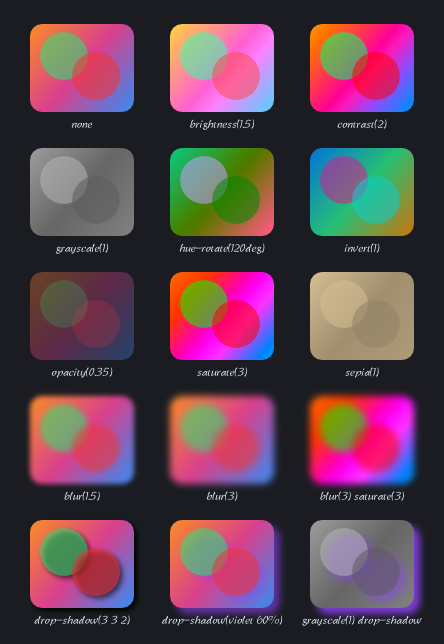

## Quick start

```sh
python3 configure.py     # generate build.ninja (first run; it self-regenerates after)
ninja                    # build every variant, run the suite, re-render the gallery
ninja test               # just the tests (subset of the default build)
ninja images             # just (re)render the gallery PNGs (subset of default)
ninja fuzz               # build the libFuzzer harnesses (needs brew llvm; fuzz/README.md)
ninja benchcmp           # hyperfine: release vs unsafe (cost of -fbounds-safety)
ninja profile            # sample(1): per-kernel self-time within each bench
ninja profile-scene      # sample(1): self-time across the whole gallery (real scenes)
ninja rendercmp          # hyperfine: real-pipeline render, metal vs cpu compositor
ninja gputime            # Metal GPU execution time (ns total, us/dispatch)
ninja throughput         # size-normalised render throughput (Mpx/s, ns/px)
ninja coverage           # refresh docs/coverage.md (llvm-cov over src/, all tests)
```

The coverage report is checked in at **[docs/coverage.md](docs/coverage.md)** so it
browses on GitHub; `ninja coverage` regenerates it, so a `git diff` shows what moved.

Requirements: macOS with Xcode (Apple clang 21+, which has `-fbounds-safety`,
`#embed`, and a Metal device), and ninja. `ninja benchcmp` also needs
[hyperfine](https://github.com/sharkdp/hyperfine). No offline Metal toolchain
component is needed — the shader is embedded with `#embed` and compiled at runtime.

Variants are produced from one source tree, crossing the optimisation/safety
flags with the compositor backend (`-cpu` links the software compositor and no GPU
frameworks):

| Variant | Flags | Story |
|---|---|---|
| `release` | `-Os -fbounds-safety` | the shipping build; bounds checks still trap |
| `debug` | `-O0 -g -fbounds-safety -fsanitize=address,integer,undefined -fno-sanitize-recover=all` | any sanitizer finding is fatal |
| `unsafe` | `-Os` | identical to release minus `-fbounds-safety`; the benchmark baseline |
| `release-cpu` / `debug-cpu` | as above, software compositor | GPU-free; cross-validates the Metal backend |

The default build runs every test binary in all four checked variants (so each
pixel test runs against *both* backends); `ninja test` is the same set on its own.
It also re-renders the gallery straight into the committed `gallery/*.png`: those
PNGs are build outputs gated on the gallery binary, so a rendering change relinks
it, re-renders them, and shows up as a `git diff` in lockstep — review and commit
the new PNGs alongside the code. Tests are silent on success, so a green `ninja`
shows only its progress line; a failing test prints the offending `CHECK` to stderr.

## Architecture

```
        public API (include/canvas.h)
                  │
   canvas.c  ── state stack, CTM, styles; rasterizes coverage, builds tiles
      │  │
      │  ├── cnvs_math     2x3 affine transforms
      │  ├── cnvs_path     subpath storage + adaptive Bézier/arc flattening
      │  ├── cnvs_cover     analytic (signed-area) coverage → per-pixel alpha
      │  ├── cnvs_gradient linear/radial/conic ramp, evaluated per pixel into a tile
      │  ├── cnvs_stroke   polyline → stroke triangles (joins, caps, dashes)
      │  ├── cnvs_image    clipped 2D RGBA8 blits (get/putImageData)
      │  ├── blur          separable box blur (shadows + filter blur()/drop-shadow(), ≈ Gaussian)
      │  ├── cnvs_geom     growable vertex/int buffers
      │  ├── cnvs_zlib     deflate + strict inflate (RFC 1950/1951) + adler32, from scratch
      │  ├── cnvs_png      RGBA8 ↔ PNG: Up-filtered encoder + strict own-output decoder
      │  ├── cnvs_record   draw calls → text canvas-program (the write side)
      │  ├── cnvs_replay   text canvas-program → draw calls (the read side)
      │  │
      │  ▼   cnvs_text.h   (C ABI: shaped runs, glyph outlines/bitmaps, font metrics)
      │  cnvs_text_ct.c  ── unsafe boundary #2: Core Text shaping + glyphs (C, no ARC)
      │
      ▼   compositor.h  (C ABI: set clip · composite a premultiplied tile · read)
   compositor_metal.m  ── unsafe boundary #1: composites premultiplied tiles onto
                          a single-sample target under a blend mode, masked by a
                          clip coverage texture, batched + read back  (ObjC + ARC)
   compositor_cpu.c   ── OR the software backend: the same ABI, one checked-C
                          blend kernel over __counted_by tiles (no GPU, no frameworks)
```

Everything above the two ABI lines is pure C23 under `-fbounds-safety`. There are
exactly two boundaries to system frameworks, each behind a bounds-safe C ABI:

- The [Metal compositor](src/compositor_metal.m) is *just* a compositor — all
  geometry, **analytic antialiasing**, gradient evaluation, and clipping happen on
  the CPU in checked C and bake into finished `_Float16` RGBA16F tiles (the
  narrowest storage type that round-trips the spec's 8-bit edges exactly — every
  colour×alpha pair survives the premultiplied store unchanged — at half f32's
  footprint; see [docs/decisions/float16-color-type.md](docs/decisions/float16-color-type.md)),
  so the GPU never rasterizes or masks. Nothing in the ABI is GPU-specific:
  the [software compositor](src/compositor_cpu.c) implements `compositor.h`
  identically in ~350 lines of checked C (its file-local per-pixel `blend()` kernel
  is the same premultiplied math the Metal shader runs), selected instead of Metal
  at build time. The two agree **bit-for-bit**
  — the software blend rounds its half stores toward zero to match Metal's
  RGBA16Float store, and the `backenddiff` gate holds the match at tolerance 0
  (see [docs/backend-differential.md](docs/backend-differential.md)) — and the
  `-cpu` build links no GPU frameworks at all.
- The [Core Text shim](src/cnvs_text_ct.c) shapes UTF-8 into glyph runs (with font
  fallback) and hands each glyph across once in canonical form: font-unit outline
  curves — which the *same* coverage rasterizer fills/strokes at every size and
  transform, so text gets gradients, transforms, clips and AA for free — or, for a
  color glyph (emoji), one fixed-size RGBA8 capture that every draw samples
  through a checked-C mip pyramid.

> These two `.c`/`.m` files are the only translation units *not* under
> `-fbounds-safety`. The Metal one *can't* be — the flag is C-only and rejects
> Objective-C. The font one *could* be, but the Core Text headers predate the flag
> and carry no bounds attributes, so binding them from checked code means forging
> every opaque handle and a scoped cast for `CGPathApply`'s callback; isolating
> that in one unchecked C TU (still ASan/UBSan-instrumented in debug) keeps the
> rest of the core uniformly checked. It's sound because `__counted_by`/`__single`
> pointers share the plain-C-pointer ABI, so each interface header is identical on
> both sides. See [docs/bounds-safety.md](docs/bounds-safety.md) for the full why.

## Public API (subset of Canvas 2D, snake_case)

```c
canvas *cv = canvas_create(width, height);   // (write canvas *__single cv under -fbounds-safety)
canvas_resize(cv, width, height)                             // realloc + clear + reset
canvas_is_context_lost                                        // always false (headless)
canvas_save / canvas_restore / canvas_reset
canvas_translate / scale / rotate / transform / set_transform / reset_transform / get_transform
canvas_set_fill_rgba / set_stroke_rgba / set_global_alpha / set_fill_rule
canvas_set_global_composite_operation                        // 26 GCO modes
canvas_set_shadow_color_rgba / set_shadow_blur / set_shadow_offset_x / set_shadow_offset_y
canvas_set_filter_none / add_filter_blur / add_filter_brightness / add_filter_contrast /
    add_filter_drop_shadow / add_filter_grayscale / add_filter_hue_rotate /
    add_filter_invert / add_filter_opacity / add_filter_saturate / add_filter_sepia
canvas_set_fill_linear_gradient / set_fill_radial_gradient / set_fill_conic_gradient / add_fill_color_stop / set_fill_pattern
canvas_set_stroke_linear_gradient / set_stroke_radial_gradient / set_stroke_conic_gradient / add_stroke_color_stop / set_stroke_pattern
canvas_set_line_width / set_line_join / set_line_cap / set_miter_limit
canvas_set_line_dash / get_line_dash / set_line_dash_offset
canvas_clear_rect / fill_rect / stroke_rect
canvas_begin_path / move_to / line_to / rect / quadratic_curve_to /
    bezier_curve_to / arc / ellipse / round_rect / round_rect_radii / arc_to / close_path
canvas_fill / canvas_stroke / canvas_clip / is_point_in_path / is_point_in_stroke
canvas_path2d_create / ..._move_to / line_to / curves / arc / rect / round_rect / close / add_path
canvas_fill_path / stroke_path / clip_path / is_point_in_path2d / is_point_in_stroke_path  // Path2D
canvas_get_image_data / put_image_data / create_image_data / read_rgba / write_png / load_png
canvas_draw_image / draw_image_scaled / draw_image_subrect   // RGBA8 source
canvas_set_image_smoothing_enabled / set_image_smoothing_quality
canvas_set_font_size / set_text_align / set_text_baseline
canvas_measure_text / measure_text_full / fill_text / fill_text_max / stroke_text / stroke_text_max  // Libian TC, UTF-8
canvas_destroy(cv);
```

Coordinates are pixels, origin top-left, +y down — matching the web platform.

## Capabilities and limitations

This table is what works; it is a *subset* of the Canvas 2D API, and several rows
are partial relative to the full spec. [docs/roadmap.md](docs/roadmap.md) is the
complete, honest gap inventory (missing + partial + what's next).

| Area | Status |
|---|---|
| Transforms, save/restore, alpha blending | ✅ |
| `fill_rect` / `clear_rect` / `stroke_rect`, solid fills, PNG export + load (Up-filtered rows, in-house deflate; the loader is strict and scoped to our own files) | ✅ |
| Paths: lines, rects, Béziers, arc, ellipse, roundRect, arcTo | ✅ (roundRect: per-corner elliptical radii) |
| `fill()` — winding rules (nonzero + even-odd), holes, self-intersection | ✅ analytic coverage |
| `stroke()` — width (CTM-scaled), miter/round/bevel joins, butt/round/square caps, line dash | ✅ |
| `getImageData` / `putImageData` (clipped 2D blits, dirty-rect, createImageData) | ◑ no colorSpace |
| `clip()` — arbitrary paths, intersection, save/restore nesting | ✅ coverage mask |
| Gradients — linear + radial + conic, fills *and* strokes, multi-stop | ✅ per-pixel, 1024-entry ramp (≤1/255 of exact) |
| Anti-aliasing | ✅ analytic coverage, both axes (fills, strokes, clips) |
| `drawImage` — transform/clip/alpha-aware, `imageSmoothingEnabled` (bilinear/nearest) | ◑ RGBA8 source only |
| Text — `fillText`/`strokeText`, Libian TC, Latin + Chinese (UTF-8), color emoji (Core Text fallback; one canonical 160px capture per glyph, mip-sampled at draw), gradient/stroke/transform, `textAlign`/`textBaseline` | ◑ no font-family/weight; full `measureText` TextMetrics |
| Compositing — all 26 `globalCompositeOperation` modes (Porter-Duff + blend modes) | ✅ |
| Hit testing — `isPointInPath` / `isPointInStroke` (+ `Path2D` overloads) | ✅ winding + even-odd, transform-aware |
| `createPattern` — image patterns, repeat/repeat-x/-y/no-repeat, transform-pinned | ✅ borrowed RGBA8, bilinear/nearest |
| `Path2D` — build, `addPath`, fill/stroke/clip/isPointIn* overloads | ✅ no SVG path-data string |
| Shadows — `shadowColor`/`shadowBlur`/`shadowOffset{X,Y}`, under fills/strokes/text/images | ✅ CPU box-blur (≈ Gaussian), coverage silhouette |
| `filter` — the eight colour functions (brightness/contrast/grayscale/hue-rotate/invert/opacity/saturate/sepia) + `blur()` + `drop-shadow()` (3-pass box ≈ Gaussian, painted region grows by the spread), per painted op, in list order | ✅ typed API, no CSS string form |
| Batched compositor submission | ✅ consecutive ops share one command buffer |

## Warning policy

Built with `-Weverything -Werror`; only these are disabled, each with a one-line
rationale in [configure.py](configure.py):

- `-Wno-poison-system-directories` — env/cross-compile artifact, not our code
- `-Wno-declaration-after-statement` — we use C23 declare-at-use style
- `-Wno-padded` — struct padding isn't a correctness signal
- `-Wno-pre-c23-compat` — we deliberately target C23
- `-Wno-implicit-void-ptr-cast` — C-only project; the idiomatic `calloc` cast
  (it does not weaken `-fbounds-safety`, which still traps undersized allocs)
- `-Wno-switch-default` — we write *exhaustive* enum switches with no default;
  `-Wswitch-enum` (kept) makes the compiler enforce that every case is handled

## Benchmarking — what does `-fbounds-safety` cost?

The natural question isn't "how fast vs. Rust" but "how much does the safety cost
*us*" — the same code, same `-Os`, with and without the flag. That's the `release`
vs `unsafe` comparison:

```sh
ninja benchcmp     # hyperfine: each phase + e2e, release vs unsafe
ninja profile      # sample(1): per-kernel self-time *within* a phase
```

The hot paths are benchmarked **in isolation** ([bench/](bench/)) so a slow phase
can't hide a regression in a faster one, plus an end-to-end run. All are CPU-only
(no GPU). A recent run on an Apple Silicon laptop:

| Phase | `release` (checked) | `unsafe` | overhead |
|---|---|---|---|
| `bench_blit` — clipped 2D RGBA8 blit (getImageData copy) | 8.6 ms | 8.6 ms | **1.00×** |
| `bench_gradient_fill` — gradient fill: 8-wide radial solve + precomputed-ramp index | 13.0 ms | 12.8 ms | **1.01×** |
| `bench_gradient` — gradient eval, per-pixel stop scan (radial solve + colour lerp) | 75 ms | 74 ms | **1.02×** |
| `bench_flatten` — cubic-Bézier flattening | 120 ms | 117 ms | **1.02×** |
| `bench_stroke` — stroke expansion (joins/caps) | 50 ms | 49 ms | **1.03×** |
| `bench_fill` — analytic coverage fill (8-wide accumulate + resolve) | 32 ms | 30 ms | **1.07×** |
| `bench_blur_v` — box blur, vertical pass (8 columns per step) | 15 ms | 14 ms | **1.09×** |
| `bench_blur_h` — box blur, horizontal pass (8-wide windows) | 34 ms | 31 ms | **1.10×** |
| `bench` — end-to-end (renders + PNG-encodes each frame, so deflate now dominates it) | 106 ms | 67 ms | **1.58×** |
| `bench_png` — PNG encode (Up filter + LZ77 deflate + HW CRC32) | 140 ms | 65 ms | **2.1×** |

The lesson is that *per-element* bounds checks are what cost, so a kernel's
overhead tracks how much it indexes vs how much it computes — **and the same
vectorization that speeds a tight loop up amortizes its checks away too.** The 2D
blit used to be the worst case at **2.5×** (four checked byte loads and stores per
pixel, no arithmetic to hide them); rewriting its inner loop as one per-row
`memcpy` made it **13× faster and dropped the safety overhead to ~1.0×** — one span
check per row instead of eight per pixel. PNG encode learned that lesson once
(its CRC moved from a byte-at-a-time table to ARMv8's `crc32` instruction, ~7×
faster at ~1.00×) and now demonstrates the converse: real compression made the
encoder LZ77-bound, and the deflate matcher's hash-chain walk is scalar indexed
byte work with nothing vectorizable to hide the checks behind, so `bench_png`
sits at the bottom of the table at **~2.1×** — the honest price of an encode
that is ~24× slower than the old stored-block escape hatch but writes files
**11× smaller** (the whole gallery went from 14.1 MB to 1.27 MB). The matcher
is the obvious next candidate for the blit treatment. The coverage fill got
the same treatment twice — the resolve (prefix sum,
fill-rule fold, 8-bit convert) runs 8-wide, and the accumulate telescopes each row
span's interior columns into a contiguous constant-add, also 8-wide with one
whole-vector check per block — taking `bench_fill` from 1.22× to **1.07×**; the
only writes still scattered are the one or two partial columns at each span's
ends. Gradients got both treatments — a 1024-entry colour
ramp built per fill (turning the per-pixel stop scan into one indexed lookup,
≤1/255 of colour error) *and* an 8-wide radial parameter solve — so
`bench_gradient_fill` (the renderer's actual path) is **~5.8× faster** than the
naive per-pixel scan (`bench_gradient`), at ~1.01× overhead: the SIMD parameter
solve stores eight lanes per `memcpy`, one bounds check instead of eight. The last
holdout was the **horizontal blur pass**, the shadow pipeline's sliding-window
sum: contiguous loads never stall, so its checks sat squarely on the critical path
at **1.55×** — until the same recipe landed there too (eight windows per step via
an in-register prefix sum of the entering-minus-leaving samples), taking it to
**1.10×** and making the *checked* build 32% faster while the unchecked build
barely moved: the entire restructuring win was amortizing the checks. Its strided
twin `bench_blur_v` then got the same recipe, simpler still (columns are
independent, so eight adjacent columns per step with a running sum per lane — no
prefix sum) — **~5.8× faster**, and its checks went from free (1.00×, hidden in
the scalar walk's slack) to **1.09×**: a loop where the checks cost nothing is a
loop with headroom left. The full anatomy — both fixes, the scheduling story, and
a since-retired prefetch experiment — is
[docs/stencil-blur.md](docs/stencil-blur.md). Real canvas
rendering is GPU-bound, so the end-to-end cost of safety is smaller still;
these are the honest prices on the hottest pure-C kernels, two commands to
re-measure (`ninja benchcmp` for the tax, `ninja profile` to see where a phase
spends its time).

## Roadmap

[docs/roadmap.md](docs/roadmap.md) is the full gap inventory. Because the project
exists to exercise `-fbounds-safety`, the near-term picks are the ones whose hot
path is dense indexed-buffer work, where bounds checking actually has something to
say (and which vectorize well). The picks on those grounds —
`globalCompositeOperation`, the software compositor, shadows, and `filter` — are
all done:

- **`filter`** is complete — the eight colour functions (`brightness`,
  `contrast`, `grayscale`, `hue-rotate`, `invert`, `opacity`, `saturate`,
  `sepia`) as per-pixel matrix kernels over checked premultiplied tiles
  ([cnvs_filter.c](src/cnvs_filter.c)), `blur()` as an RGBA16F flavour of the
  shadow pipeline's separable box blur ([blur.c](src/blur.c)) that blurs the
  op's tile against transparency, and `drop-shadow()`, which composites the
  tile over a blurred, offset, tinted copy of its own alpha. The one piece of
  `filter` not offered is the CSS string form — the typed `canvas_add_filter_*`
  calls are the API, since string parsing is exactly the kind of work this
  project deprioritizes.

What we deliberately **won't** do:

- **Force `-fbounds-safety` onto the two system-framework shims.** The Metal one
  *can't* take the flag (it's C-only, and ARC/Objective-C is required to drive
  Metal). The Core Text one *could*, but its headers carry no bounds attributes, so
  checked binding means forging every opaque handle plus a scoped cast for
  `CGPathApply` — net zero real safety, since the output buffers are checked-owned
  regardless. Both stay isolated boundary shims behind a bounds-safe C ABI. See
  [docs/bounds-safety.md](docs/bounds-safety.md).

## Layout

```
configure.py             generates build.ninja (all variants + gates; self-regenerates)
include/canvas.h         public API
src/                     C core; compositor backends (Metal .m / software .c); Core Text shim
shaders/compositor.metal tile vertex+fragment shaders (embedded via #embed)
tests/                   unit + pixel tests, a bounds-safety trap test, the OOM fault-injection sweep
bench/                   isolated kernel benches + end-to-end (ninja benchcmp / profile / throughput)
diff/                    backend differential: render on both backends, diff (ninja backenddiff)
fuzz/                    libFuzzer harnesses + committed regression corpus (ninja fuzz)
examples/gallery.c       renders the gallery PNGs (ninja images)
gallery/                 committed showcase PNGs
secreview/               point-in-time security review + proof-of-concept
docs/bounds-safety.md    the write-up
docs/backend-differential.md  making the Metal + software backends bit-identical
docs/roadmap.md          Canvas 2D gap inventory (missing + partial + what's next)
docs/coverage.md         checked-in coverage report (ninja coverage regenerates)
docs/*.md                the probe field notes: pixel pipelines, stencil blur,
                         gather LUT, range folding, tag pointers, sparse coverage,
                         the text boundary
```
